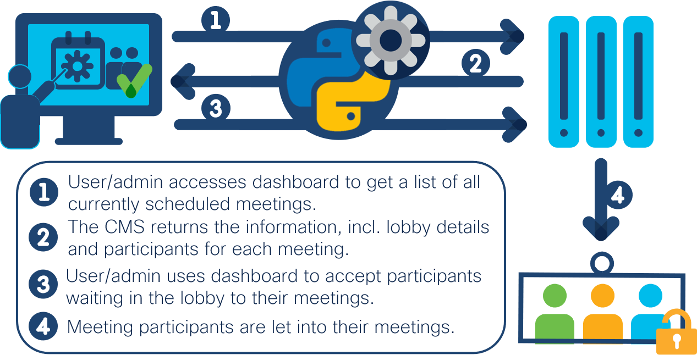
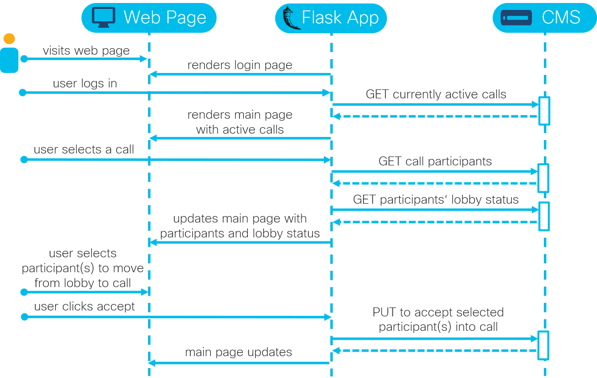

# Cisco Meeting Server Lobby Management

An application to manage participants waiting in the lobby of active calls that are running on the Cisco Meeting Server ([watch demo](https://youtu.be/irK0ElGctjU)).

## Overview
 

**Cisco Meeting Server**: The [CMS](https://developer.cisco.com/cisco-meeting-server/) brings premises-based video, audio, and web communication together to meet the collaboration needs of the modern workplace. Through the use of its APIs, calls and conferences can be flexibly managed and integrated into existing business workflows. This application focuses on managing the participants waiting in the lobbies of all active calls. It enables accepting participants either individually or in bulk to their respective calls.  

**Web Page**: To manage participants waiting in the lobby, users access a simple web page, where they can select all currently active calls, retrieve participants both waiting in the lobby and already in eacg call, and ultimately, choose participants to move from waiting in the lobby to being accepted to the respective call. In this sample code, a login page is also implemented in the workflow.

**Flask**: The application is written in Python using the micro web framework Flask. The web server that is part of Flask should not be used in production. 

### Sequence Diagram:

## Contacts
* Jara Osterfeld (josterfe@cisco.com)

## Solution Components
* Cisco Meeting Server
* Python
* Flask

## Installation

1. Clone this repository with `git clone <this repo>` and navigate to the directory with `cd <directory/to/repo>`.

2. (Optional) Create a Python virtual environment and activate it (find instructions [here](https://docs.python.org/3/tutorial/venv.html)).

3. Navigate to the root directory of the repository, and install the requirements with `pip install -r requirements.txt`.

4. Open the `main.py` file, and fill in the following variables: 
        
        username = '' # username to CMS
        password = '' # password to CMS
        cms_ip = '' # IP address or DNS name of CMS
        port = '' # https port on CMS

5. Set the following environment variable: `set FLASK_APP=main.py`.

6. Start the Flask app with `flask run -p 5000`.

7. In your web browser, navigate to http://localhost:5000/. 

## License
Provided under Cisco Sample Code License, for details see [LICENSE](./LICENSE).

## Code of Conduct
Our code of conduct is available [here](./CODE_OF_CONDUCT.md).

## Contributing
See our contributing guidelines [here](./CONTRIBUTING.md).